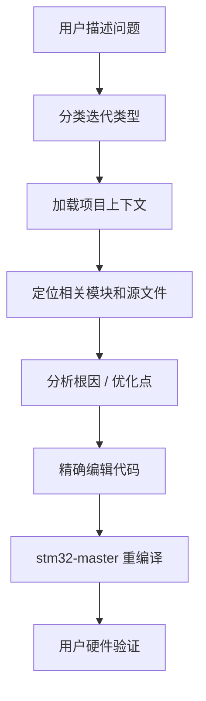
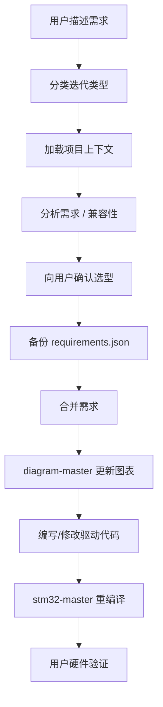

# Iteration Master — 嵌入式项目迭代升级

### 修 Bug · 加功能 · 换模块 · 优化性能

---

> 已有项目的增量迭代工具，自动分类迭代类型，增量合并需求，精确修改代码，一键重编译烧录

[快速开始](#快速开始) · [四种迭代类型](#四种迭代类型) · [工作流程](#工作流程) · [需求合并规则](#需求合并规则) · [项目结构](#项目结构)

---

## 它做什么

当已有项目需要修改时，自动分析用户意图，按类型执行不同的迭代流程：

```
用户："温度传感器读数不对"
        ↓
┌─────────────────────────────────────┐
│  分类     识别为 Bug 修复            │
│  加载     读取 requirements.json     │
│  定位     找到温度传感器相关代码      │
│  诊断     分析根因                   │
│  修复     精确编辑源文件             │
│  重编译   调用 stm32-master          │
└─────────────────────────────────────┘
```

## 快速开始

由 `embedded-pipeline` 自动路由，无需直接调用。当项目目录下存在 `requirements.json` 且用户消息匹配迭代关键词时，自动进入迭代模式。

### 触发示例

| 你说的话 | 迭代类型 | 发生了什么 |
|---------|---------|-----------|
| "温度传感器读数不对" | Bug修复 | 诊断代码 → 修复 → 重编译 |
| "给声控灯加一个蓝牙模块" | 功能添加 | 分析需求 → 确认选型 → 合并需求 → 更新图表 → 写驱动 → 重编译 |
| "把DHT11换成DS18B20" | 硬件更换 | 兼容性分析 → 确认 → 替换需求 → 更新图表 → 换驱动 → 重编译 |
| "优化一下ADC采样的精度" | 性能优化 | 分析代码 → 应用优化 → 重编译 |

---

## 四种迭代类型

### Bug修复

**不改需求，不改图表，只改代码。**

- 从 requirements.json 定位相关模块
- 读取源文件，分析根因（配置错误/时序问题/数据处理/硬件接线）
- 对源文件进行精确编辑（surgical edit）
- 重编译烧录

### 功能添加

**增量追加，不覆盖已有内容。**

- 分析新功能需要的硬件模块、接口、引脚
- 向用户确认关键选型（1-2 个问题）
- 备份 requirements.json → 追加新模块到 inputs/outputs
- 重新生成接线图、流程图、软件设计文档
- 编写新驱动代码，修改 main.c（不重写已有代码）
- 重编译烧录

### 硬件更换

**原地替换，精确更新。**

- 分析新旧模块差异（接口/电压/引脚/协议/时序）
- 向用户确认影响（如"是否需要保留湿度传感功能？"）
- 备份 requirements.json → 在数组中找到旧模块原地替换
- 重新生成受影响的图表
- 替换驱动文件，更新 main.c 引用
- 重编译烧录

### 性能优化

**不改需求，不改图表，只优化代码。**

- 从 requirements.json 定位相关模块
- 读取源文件，识别优化点
- 应用优化（过采样/DMA/校准/查表等）
- 重编译烧录

---

## 工作流程

### Bug修复 / 性能优化 流程



### 功能添加 / 硬件更换 流程



---

## 需求合并规则

### 增量合并原则

| 原则 | 说明 |
|------|------|
| **追加不覆盖** | 新模块追加到数组末尾，已有条目不动 |
| **原地替换** | 硬件更换时，按模块名找到旧条目原地替换 |
| **版本备份** | 每次修改前备份为 `requirements.v{N}.json` |
| **变更日志** | 在 requirements.json 中维护 changelog 数组 |

### 备份文件

```
项目目录/
├── requirements.json        ← 当前版本
├── requirements.v1.json     ← 第一次迭代前的备份
├── requirements.v2.json     ← 第二次迭代前的备份
└── ...
```

### changelog 字段

每次迭代自动在 requirements.json 中追加变更记录：

```json
{
  "changelog": [
    {
      "version": 2,
      "date": "2026-05-05",
      "type": "feature_addition",
      "description": "添加蓝牙模块 HC-05",
      "changes": {
        "added": [{ "module": "HC-05", "interface": "UART", "pin": "PA9,PA10" }]
      }
    }
  ]
}
```

---

## 项目结构

```
iteration-master/
├── SKILL.md                # 迭代协议定义（4种类型的完整执行流程）
├── README.md               # 项目说明文档
├── index.js                # 入口文件，统一导出所有函数
├── classifier.js           # 迭代类型分类器（关键词匹配）
├── context-loader.js       # 项目上下文加载（requirements.json + 项目结构）
├── requirements-merge.js   # 需求增量合并（备份 + 合并 + changelog）
└── iteration-prompts.js    # 4种迭代类型的分析 prompt 模板
```

### 模块职责

| 模块 | 职责 |
|------|------|
| `classifier.js` | 从用户消息中提取关键词，分类为 bug_fix / feature_addition / hardware_change / optimization |
| `context-loader.js` | 加载 requirements.json、扫描源码目录、推断文件结构 |
| `requirements-merge.js` | 深拷贝需求、增量合并、版本备份、变更日志、影响模块检测 |
| `iteration-prompts.js` | 为 4 种迭代类型生成分析用的 prompt 模板 |

---

## 工作流位置

```
①需求分析大师 → ②效果呈现大师 → ③代码实现大师
 需求文档         接线图/架构图       编译/烧录/调试/监控
                                      ↑
                         迭代升级从这里接入
                         (修改代码 → 重编译)
                         (改需求 → 改图表 → 改代码 → 重编译)
```

---

## 与新建模式的对比

| | 新建模式 | 迭代模式 |
|---|---------|---------|
| **入口** | "我要做个XX" | "给XX加个YY" / "XX有问题" |
| **需求** | 从零生成 | 增量合并，备份旧版本 |
| **图表** | 从零生成 | 按需重新生成（Bug/优化不改） |
| **代码** | 从零生成 | 精确编辑 / 增量添加 |
| **调用 skill** | requirements-master → diagram-master → stm32-master | iteration-master → (diagram-master) → stm32-master |
